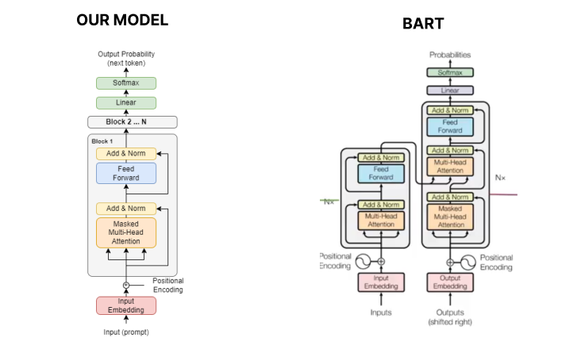

# Models


## Getting Started
Install packages from ```requirements.txt```

### Groundup
1. Training Slogan Model ```python3 groundup/slogan/training.py```
2. Running program ```python3 groundup/slogan/main.py```

### BART
1. Run notebook located at ```bart/bartmodel.ipynb```

## Sources
[Decoder Only Architecture](https://ai.stackexchange.com/questions/40179/how-does-the-decoder-only-transformer-architecture-work)

