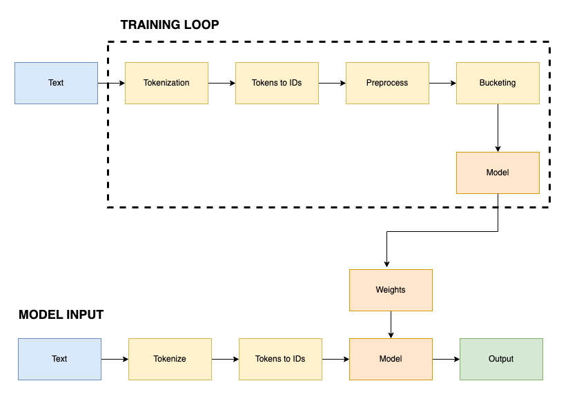

# Process Overview

## Model

## Data Team
#### Members
- Shreyansh
- Ashwini
- Nihit

#### Responsibility
- Populate the dataset with information about the companies
- Preprocess the data
  - Concatenation
  - Tokenizing & Detokenizing
  - Bucketing

 
## Model Team
#### Members
- Carl
- Mitali

#### Responsibility
- Implement Attention
  - Dot Product Attention
  - Causal Attention
- Implement Decoders
  - Greedy Decoding
  - Beam Search Decoding
- Create the model from the subcomponents

#### Sources
[Decoder Only Architecture](https://ai.stackexchange.com/questions/40179/how-does-the-decoder-only-transformer-architecture-work)
